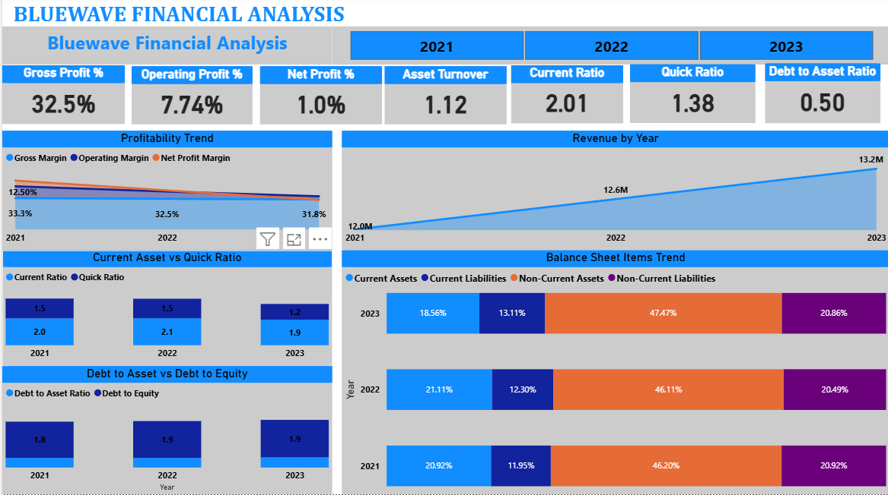
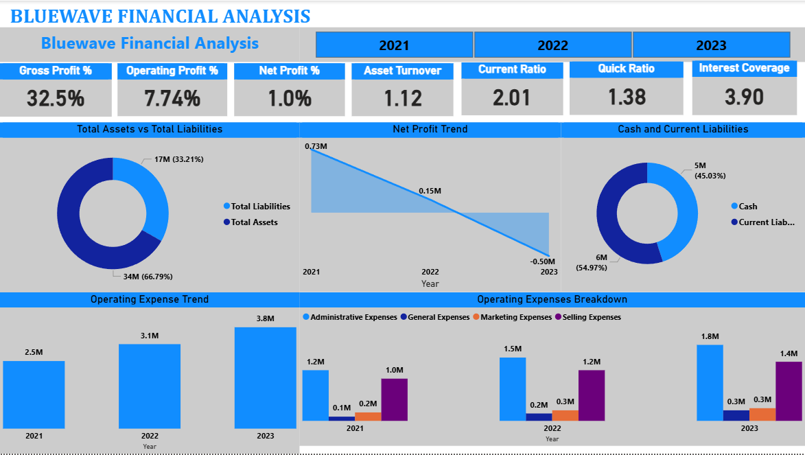

# BlueWave Logistics – Financial Analysis & Reporting

A financial analysis case study evaluating profitability, liquidity, efficiency, and solvency for a regional logistics company, with Power BI reporting to support a green logistics investment decision.

## Business Context

BlueWave Logistics is a regional logistics company offering freight transportation, warehouse management, and supply chain optimization, serving small and medium-sized retail, manufacturing, and e-commerce clients over its 15 years of operation. Demand has grown alongside the rise of e-commerce, but rising fuel costs, fleet management inefficiencies, and high warehouse maintenance expenses are squeezing margins — and the company is now weighing a significant investment in green logistics and fleet modernization.

## Problem Statement

Acting as the financial analyst, this project evaluates BlueWave's current financial health, identifies the operational inefficiencies driving cost pressure, and assesses whether the proposed green logistics investment would improve profitability and competitiveness without compromising long-term sustainability.

## Objectives

This analysis sets out to:
1. Evaluate the key financial statements and calculate ratios across profitability, liquidity, efficiency, and solvency.
2. Pinpoint specific areas of concern — e.g. elevated costs, inefficient inventory management, or weak cash flow.
3. Recommend actionable strategies to improve financial performance and support long-term sustainability.
4. Translate financial insights into decisions that support competitive advantage.

## Methodology

| Category | Ratios Computed |
|---|---|
| Profitability | Gross Profit Margin, Net Profit Margin, Operating Margin |
| Liquidity | Current Ratio, Quick Ratio, Cash Ratio |
| Efficiency | Inventory Turnover, Accounts Receivable Turnover, Asset Turnover |
| Solvency | Debt-to-Equity, Debt-to-Assets, Interest Coverage |

Ratios were calculated and trended in Excel, then the cleaned data and analysis results were brought into Power BI to build an interactive dashboard for reporting findings.

## Key Findings

- **Revenue grew, but profit collapsed.** Revenue rose from $12.6M (2022) to $13.2M (2023), continuing a multi-year upward trend — yet net profit moved in the opposite direction, falling from $0.73M (2021) to $0.15M (2022) and turning into a net loss of -$0.50M in 2023.
- **Operating costs are growing faster than revenue.** Total operating expenses rose 52%, from $2.5M (2021) to $3.8M (2023), with Administrative expenses ($1.2M → $1.8M) and Selling expenses ($1.0M → $1.4M) accounting for most of the increase.
- **Margins are compressing across the board.** Operating margin nearly halved, from roughly 12.5% (2021) to 7.74%, while gross margin held closer to flat (33.3% → 32.5%). Net margin sits near breakeven at 1.0%, consistent with 2023 tipping into a loss.
- **Liquidity is still adequate but trending down.** Current ratio slipped from 2.1 (2022) to 1.9 (2023), and quick ratio from 1.5 to 1.2 — both remain above the 1.0 minimum, but the direction is worth watching given the scale of the proposed investment.
- **Leverage and interest coverage remain manageable for now.** Total liabilities of roughly $17M against $34M in total assets put the debt-to-asset ratio at 0.50, and interest coverage of 3.90x shows operating income still comfortably covers interest obligations — though that cushion would shrink quickly if losses continue.

## Power BI Dashboard

## Recommendations

1. **Hold off on full-scale green logistics investment until profitability stabilizes.** Committing significant capital while net income is negative and operating margin has nearly halved carries real cash flow risk; a phased rollout tied to specific profitability milestones is safer than a single large outlay.
2. **Target Administrative and Selling expenses directly** — these two categories drove most of the $1.3M increase in operating costs since 2021. A cost review here (overhead, headcount, distribution efficiency) would do more for margins in the short term than topline growth alone.
3. **Avoid additional debt-funded investment for now.** With interest coverage at 3.90x and liquidity already softening, taking on new financing for fleet modernization would tighten the margin of safety further if the net loss trend continues into 2024.
4. **If the investment proceeds, fund it from cost savings rather than new borrowing** — using the administrative/selling expense review above to free up cash, rather than compounding the leverage and liquidity pressure already visible in the 2021–2023 trend.

## Files in This Project

- `BlueWave_Financial_Analysis.xlsx` — source financials and ratio calculations.
- `BlueWave_Dashboard.pbix` — Power BI dashboard (open with Power BI Desktop).
- `images/` — exported dashboard and chart images used in this README.

## Tools Used

Excel (ratio modeling and trend analysis), Power BI (interactive dashboard and reporting)
